# inria-aphp

réponse à l'exercice https://github.com/agramfort/inria-aphp-assignment


## Setup

```
git clone https://github.com/BenjaminHabert/inria-aphp.git
cd inria-aphp

python3 -m venv .venv
source .venv/bin/activate
pip install -r requirements.txt

# lint and test
flake8 aphp/
python -m pytest

# running notebooks
export PYTHONPATH=$PYTHONPATH:$(pwd)
jupyter notebook
```

## Organisation des fichiers

- le notebooks [check_raw_patient_data](notebooks/2020-09-13_check_raw_patient_data.ipynb) contient une analyse de qualité des données partients

# Notes

- Qualité des données
    - [analyse de la qualité des données patient](#données-patient)
    - [analyse de la qualité des données PCR](#tests-pcr)

- [Méthodologie de déduplication](#suppression-des-doublons)
    - [Résultats](#résultats)

- [Analyse statistique des résultats de tests PCR](#analyse-des-résultats-de-test-pcr)

## Qualité des données

Nous indiquons ici les conclusions principales. Ces observations sont prises en compte dans le nettoyage
des données brutes.

### Données patient

20000 lignes

Voir [check_raw_patient_data](notebooks/2020-09-13_check_raw_patient_data.ipynb) pour plus de détails.

- Certains `patient_id` sont dupliqués et ne correspondent pas au même patient. On ne peut donc pas prendre en compte ces
  données: impossible de savoir à quelle personne attribuer l'ID.

- Inversement, un même patient peut être identifié par plusieurs `patient_id`. Il sera nécessaire de conserver l'ensemble
  des IDs d'un patient pour faire une jointure avec d'autres données (tests PCR).

- Dans la date de naissance, seule le mois et le jour de naissance peuvent être exploités (pas l'année). On décide de
  remplacer par une colonne `birthday`.

- L'age semble cohérent mais il est surprenant de ne trouver presque aucun patient de plus de 40 ans.

    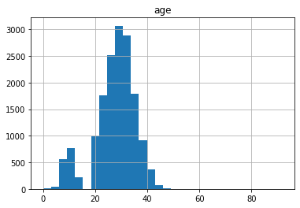

- On trouve les erreurs habituelles sur le nom et le prénom:
    - inversion des deux colonnes
    - typos

- quelques erreurs de saisie pour `state`. Après correction on constate que les patients viennent de tous les états

    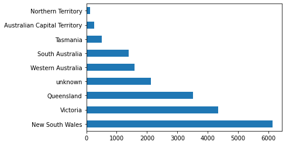

- le `postcode` est plutôt bien renseigné. Dans quelques rares cas (14), le code postal est dans la colonne `suburb`
- les `phone_number` sont correctement formatés. Seulement 20% sont des numéros de téléphone mobile.

- **Après nettoyage des valeurs erronnées**, le pourcentage de valeurs manquantes est le suivant:

    ```
    patient_id        0.000000
    given_name        2.189111
    surname           2.138082
    street_number     1.908455
    address_1         3.985304
    suburb            1.035873
    postcode          0.995050
    state            10.644486
    age              19.982650
    phone_number      4.607848
    address_2        60.580701
    birthday         10.965964
    ```


### Tests PCR

- pas de valeurs manquantes. 8800 résultats de test

- on choisit de reformatter la colonne `pcr` en booléen en prenant en compte
  les différents textes (exemple, `'Positive' == 'P' == True`)

- pour 35 `patient_id`: plusieurs résultats de test. On choisit de considérer un ensemble de tests comme positif 
  si au moins l'un de ces tests est positif.

- tous les IDs dans cette table sont présents dans la table des patients. Malheureusement on perd 1.5 % des résultats
  de tests PCR lorsque l'on supprime les patients avec un ID erronné (on ne sait pas à qui attribuer un ID parmis 2
  patients)

- Au final, le nombre de tests positifs est:

    ```
    False    6583
    True     2182
    Name: pcr_positive, dtype: int64
    ```

## Suppression des doublons

#### Problématique

En explorant les données, nous constatons des patients en doublons. Le travail de suppression de doublons est ici
un peu complexe pour deux raisons:

- il n'existe pas un critère unique de dé-doublonnement. Au contraire, on remarque qu'il peut y avoir des variations
    (erreurs de saisie) dans le nom du patient, que certaines données peuvent manquer. Il faudra donc s'appuyer sur un
    ensemble de critère "flexibles" pour regrouper des lignes en un seul patient

- on souhaite conserver l'ensemble des `patient_id` associés à un même patient. En effet, un même patient a pu
    réaliser plusieurs tests PCR, chacun correspondant peut être à un `patient_id` différent.

Une possibilité pour trouver les doublons dans ce jeu de données serait de comparer **toutes** les paires de patient
(*self-merge* complet du dataset) puis d'appliquer une fonction de comparaison qui décide si la paire correspond à un
unique patient.
Cette méthode est très coûteuse en ressource (surtout RAM avec Pandas) et serait difficile à appliquer à un jeu de données
complet (nous n'avons ici que 20 000 lignes).

#### Méthode utilisée


Nous choisissons donc une autre approche, plus modulaire et *scalable*. Nous utilisons plusieurs fonctions de regroupement
et de comparaison. Par exemple:

- on commence par regrouper les lignes ayant le même numéro de téléphone (critère exact)
- on analyse ensuite dans ce (petit) groupe les paires de patients pour savoir s'il faut les regrouper. On peut 
utiliser alors des critères moins précis qui prennent par exemple en compte les éventuelles erreurs de saisie


En utilisant cette méthode, les patients sont actuellement regroupés selon les critères suivant:

- même numéro de téléphone et l'une des conditions suivantes:
    - même prénom
    - ou même date d'anniversaire
    - ou nom complet très similaire (distance de Levenshtein de 3 ou moins)
- ou même code postal et date d'anniversaire avec les conditions:
    - nom complet similaire
    - et même age


Puisque ces méthodes utilisent des critères plutôt explicites, il est facile d'ajouter ou de supprimer des critères
au cours du projet. Les critères utilisés ici correspondent à une première itération de ce travail de déduplication.

#### Détails d'implémentation

Nous avons choisi de découper la détection de doublons en plusieurs méthodes modulaire. 
Afin qu'une de ces méthodes puisse être ajoutée / supprimée / modifiée sans impacter les autres,
il est préférable qu'elle n'intervienne pas directement sur le dataframe.

Par conséquent, nous organisons le code de cette manière:

- chaque méthode de détection retourne une liste de paires d'id `[(id_1, id_2), (id_13, id_54), ...]`
qui représente un doublon
- lorsque toutes les méthodes ont été appliquées, on utilise les paires pour créer des groupes d'id qui représentent
  le même patient
- en utilisant ces groupe, on applique enfin la déduplication au dataframe de patients. L'ensemble des id est
conservé dans une nouvelle colonne `all_patient_ids` qui contient une liste.
    - *note*: au moment de cette dé-duplication, on cherche à consolider les informations. Par exemple, parmis les
        doublons, on conserve le prénom le plus fréquent. De cette manière on conserve probablement un prénom
        sans erreur de saisie.

#### Résultats

On passe de 19597 lignes à 18376 patients dé-doublonnés (réduction de 6.2%).

```
Found 1636 pairs of duplicates using phone numbers.
Found 631 pairs of duplicates using birthday and postcode.
Found 1798 total pairs of duplicates.
Patient deduplication: 19597 -> 18376


<_find_pairs_from_phone> - 1.1 s
<_find_pairs_from_postcode_and_birthday> - 1.1 s
<_keep_one_line_per_patient> - 8.2 s
<_deduplicate> - 8.3 s
<detect_duplicates> - 10.6 s
```

Voici la statistique du nombre de lignes regroupées en un seul patient:

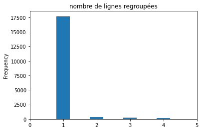

En explorant rapidement le jeu de données final, on constate qu'il contient toujours quelques doublons.
Par exemple il existe encore 1 numéro de téléphone
avec 3 doublons.

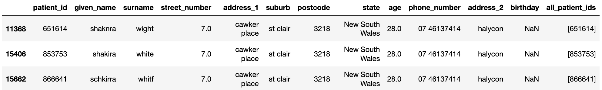

Ces lignes pourraient être regroupées en étant plus permissif sur la ressemblance entre les noms complets. Cependant
on risque également de regrouper des lignes qui ne devraient pas l'être.

## Analyse des résultats de test PCR

Nous réalisons la jointure entre la liste des patients et les résultats de test PCR en utilisant la colonne
`all_patient_ids` qui contient la liste des id pour chaque patient après dé-doublonnage.
Comme nous l'avions constaté précédemment, il peut y avoir plusieurs résultats de test pour un même patient.
Nous choisissons qu'un patient est testé positivement si au moins l'un des tests PCR a un résultat positif.


Pour une analyse des résultats, nous conservons seulement les colonnes suivantes:
`["age", "postcode", "state", "pcr_positive"]`. De cette manière nous travaillons avec un jeu de donnée à
l'échelle du patient mais qui ne contient pas d'information identifiante.

Nous étudions la fraction des patients ayant bénéficié d'un test PCR et la prévalence (taux de tests positifs)
en fonction de plusieurs critères:
- population globale
- par classes d'age
- par état

Dans la population globale, nous observons:
- 45% des patients de la base ont été testés à l'aide d'un test PCR
- parmis ceux-ci, **25% des patients sont testés positivement**. Cette statistique est très surprenante puisque le taux
  de tests positifs rapporté par le [ministère de la santé](https://www.health.gov.au/news/health-alerts/novel-coronavirus-2019-ncov-health-alert/coronavirus-covid-19-current-situation-and-case-numbers#tests-conducted-and-results)
  est de **0.4%** au niveau national.

  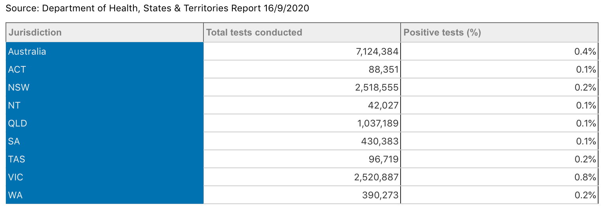

Nous ne savons pas comment expliquer cette différence énorme. Il peut y avoir une erreur dans la manière dont les données
sont traitées. Peut être que la table de patients dont nous disposons correspond à une population très particulière.


En étudiant par classe d'age puis par état, nous somme surpris de constater que le taux de test et la
prévalence sont très uniformes.

- par classe d'age :

  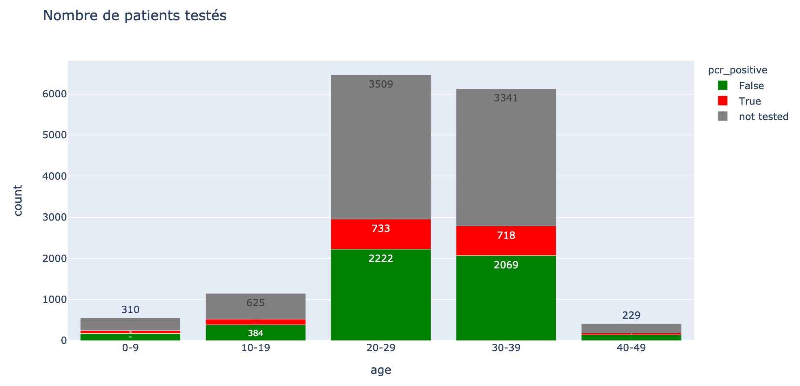

  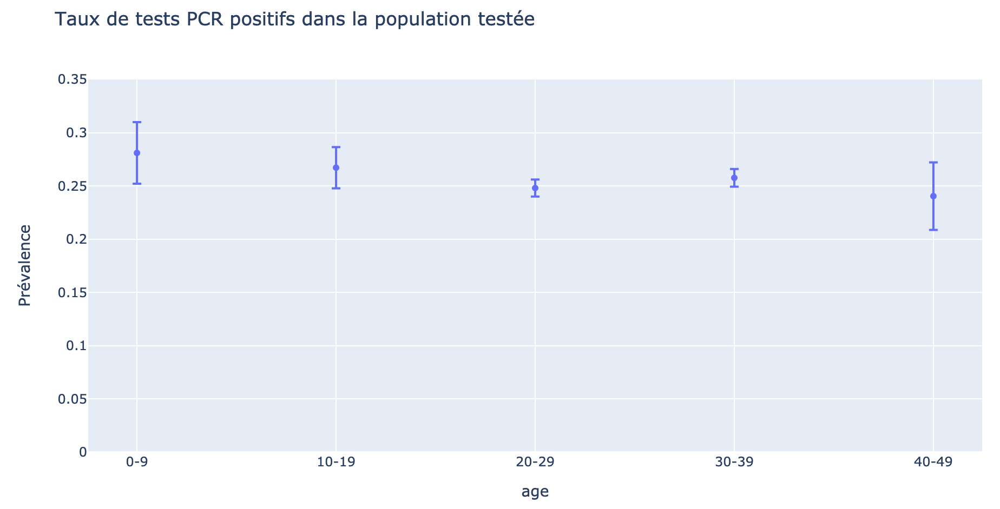


- par état :

  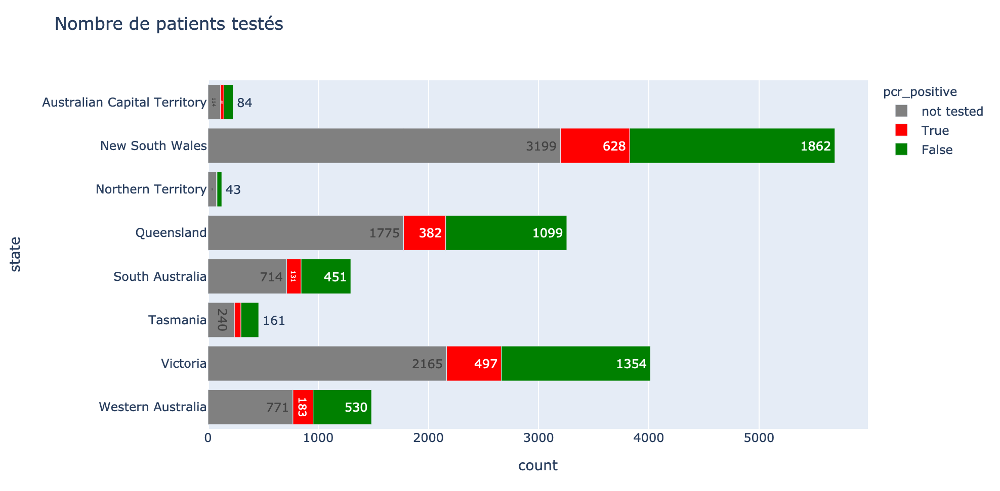

  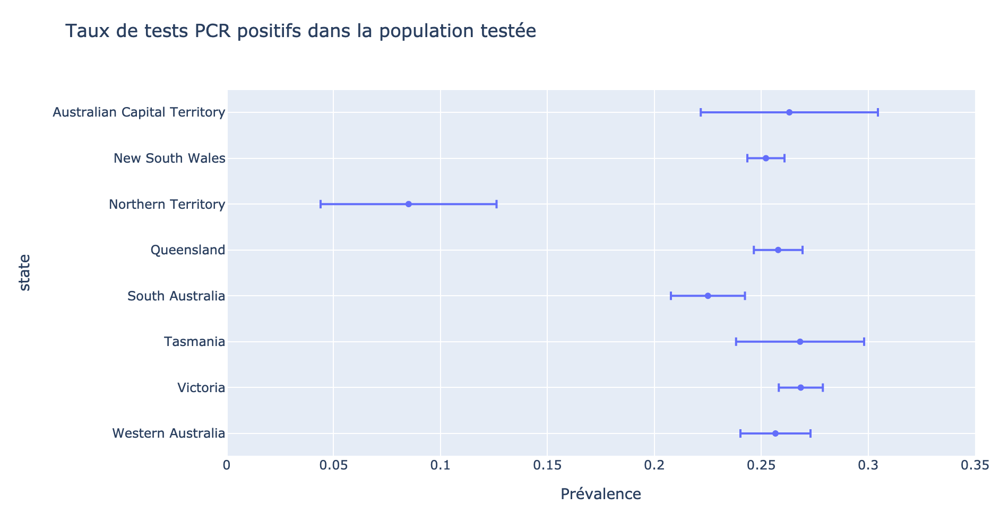


### Apport de données externes

Nous souhaitons exploiter la colonne `postcode` pour enrichir le jeu de données. Nous récupérons les
données suivantes:
- correspondance `postcode -> lga_code` (source: [Australian Bureau of Statistics](https://www.abs.gov.au/AUSSTATS/abs@.nsf/DetailsPage/1270.0.55.003July%202019?OpenDocument))
- densité de population par `lga_code` (source: [Australian Bureau of Statistics](https://www.abs.gov.au/AUSSTATS/abs@.nsf/DetailsPage/3218.02016-17?OpenDocument))
- contours géographiques des `lga_code` (source: [Australian Bureau of Statistics](https://www.abs.gov.au/AUSSTATS/abs@.nsf/DetailsPage/1270.0.55.003July%202019?OpenDocument))

*Note: nous ne conservons dans le repo qu'une version simplifiée de ces données)*


A partir de ces données, nous pouvons réaliser une courte étude à l'échelle LGA (*Local Government Area*).

- la densité de population ne semble pas avoir d'impact sur la prévalence (la taille des points représente le nombre
  de patients)

  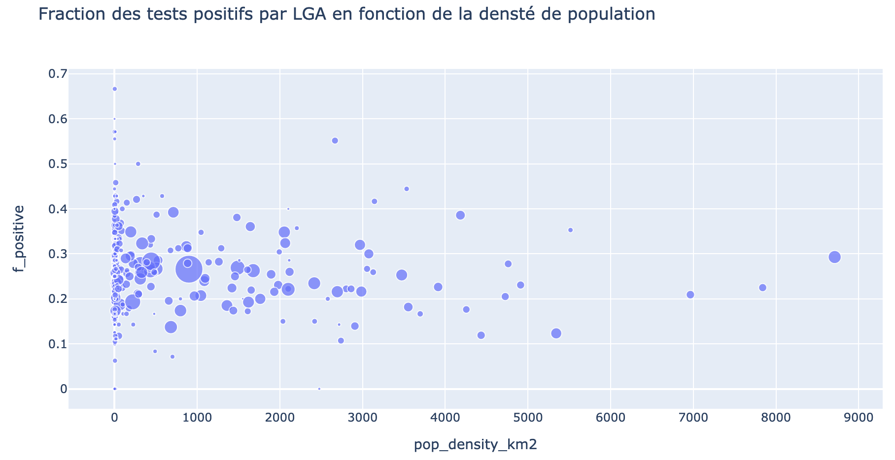


- une représentation cartographique ne révelle pas non plus de distribution spatiale particulière. Les zones grises
  correspondent à un nombre de patients testés inférieur à 5.

  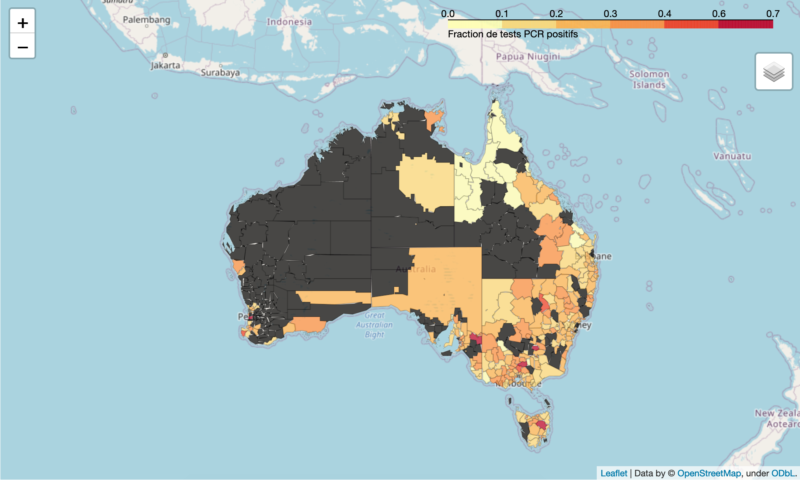
  

